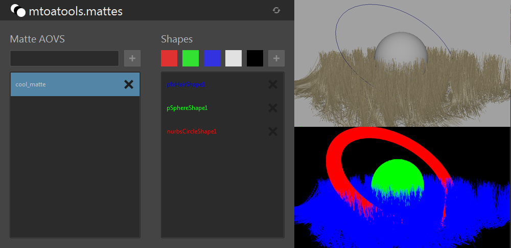

=========
mtoatools
=========

.. image:: https://img.shields.io/pypi/v/mtoatools.svg
        :target: https://pypi.python.org/pypi/mtoatools

MtoAtools is a set of production tools for use with Arnold for Maya. This package will grow over time.

mattes
======
UI for managing Matte AOVs.

Documentation
=============
You can find more documentation at https://mtoatools.readthedocs.org.
