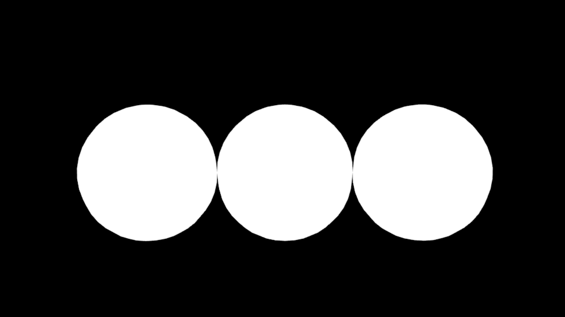
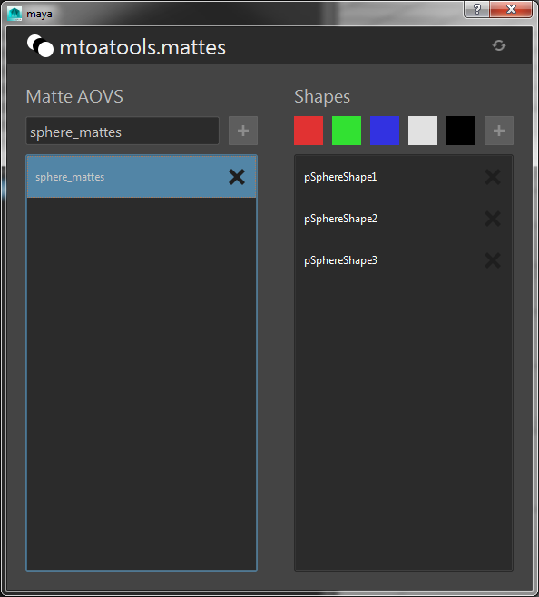
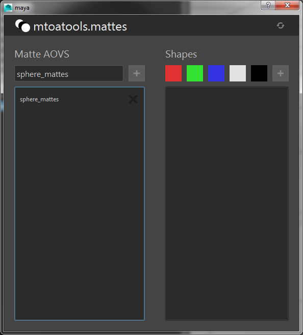
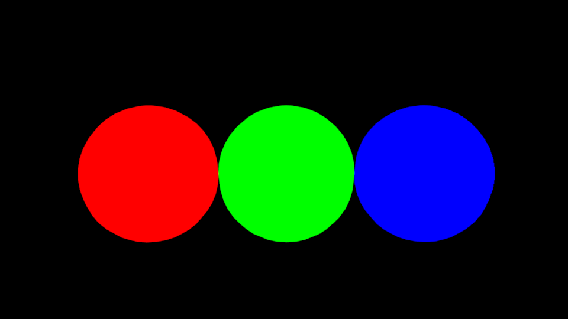
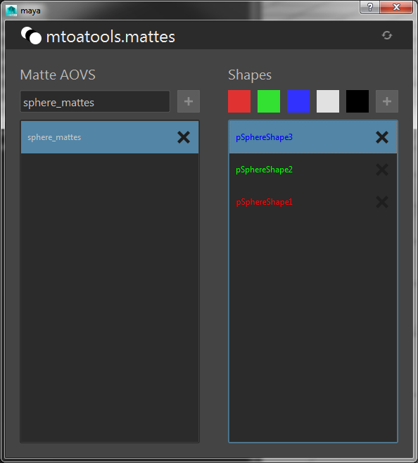
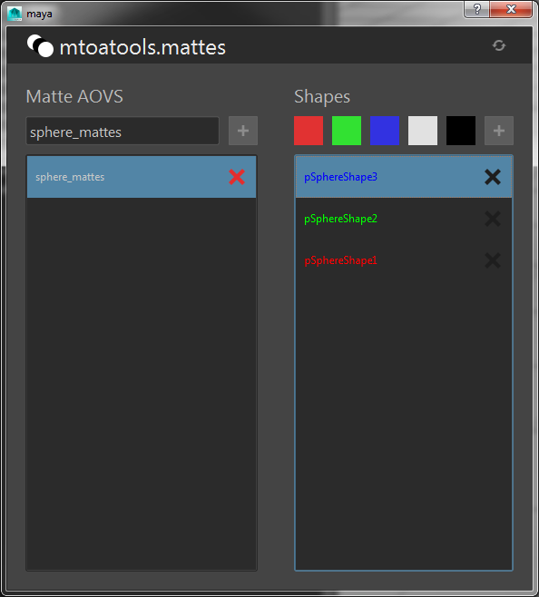
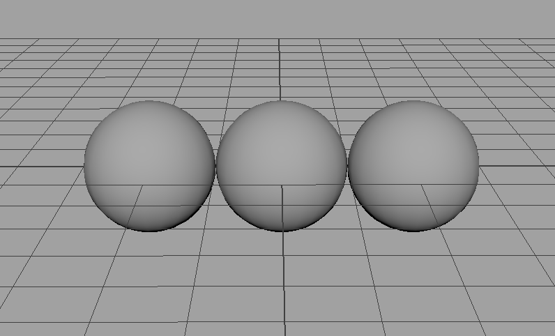

======
mattes
======
A guide to creating Matte AOVs using mtoatools.

Is Arnold your current Renderer?
================================
Before we begin, make sure the mtoa plugin is loaded, and your current renderer is set to Arnold.

Now load up the mattes ui by clicking the |mattesicon| button on the mtoatools shelf. The following ui will appear.

|freshui|

Right, now we can add some mattes to a scene. Let's create 3 polySpheres lined up along the X axis. Like so...

|scenespheres|

Create your first matte
=======================
Select the 3 spheres you just made. Type *sphere_mattes* into the line edit field of the mattes ui and click the *+* icon.

|newmatte|

A new matte will be created named sphere_mattes including the 3 spheres you selected. If you select the new matte from the *Matte AOVs* list you should see the following.

|whitemattes|

The color of the text for each shape corresponds to the color it will be when rendered. As you can see, the default color is white. Here's what we get when we render our sphere_mattes AOV right now.

|whiterender|

Colored Mattes
==============
You can create colored mattes by selecting the geometry from the *Shapes* list and clicking one of the colored swatches. You can also select the geometry directly in your viewport and the corresponding list item will be selected in the *Shapes* list. Let's assign red, green, and blue to the 3 spheres.

|coloredmattes|

Now lets render the matte again and take a look at our colored mattes.

|colorrender|

Removing Mattes and Shapes
==========================
At any point you can delete a matte or remove a shape from a matte by clicking the *X* button on one of the list items.

|removehighlight|

Renaming Mattes
===============
Double click on a matte list item to rename a matte. Press escape to abort.

The how and why of mtoatools.mattes
===================================
The basic setup is to have an mtoa\_constant\_\* double3 attribute on each shape, and an AOV with an aiUserDataColor node plugged into its defaultValue. The aiUserDataColor pulls the color from the shape node mtoa\_constant\_\* attribute.

.. |mattesicon| image:: images/mtoatools_mattes.png

.. |newmatte| image:: images/new_matte.png

.. |freshui| image:: images/fresh_ui.png

